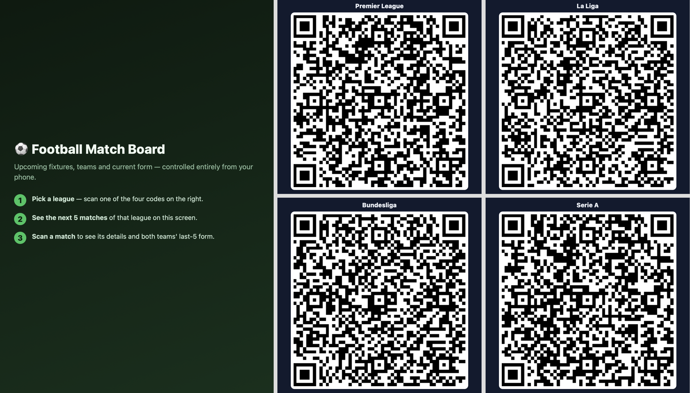
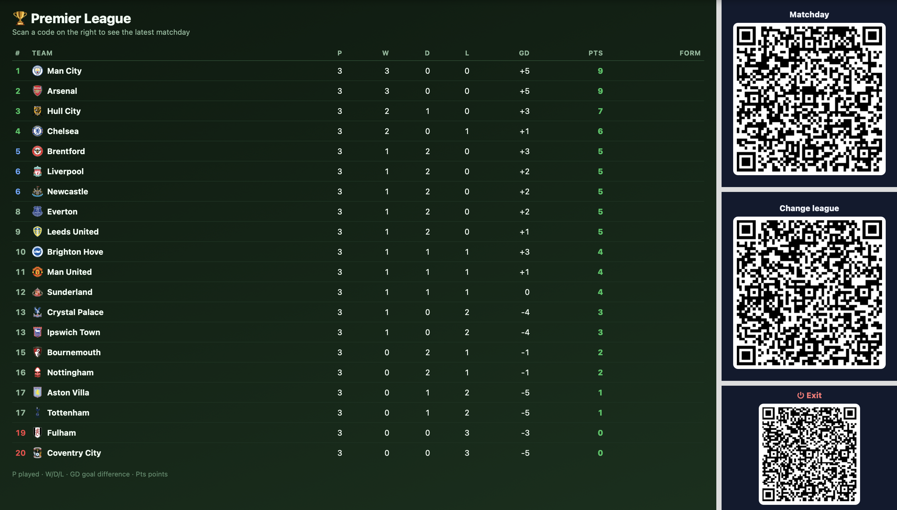
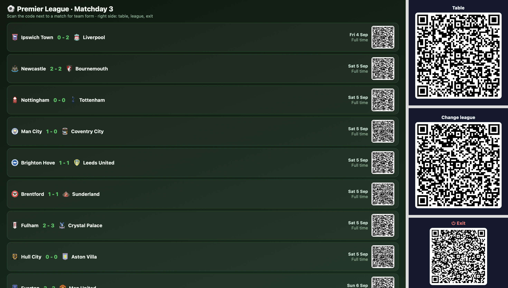
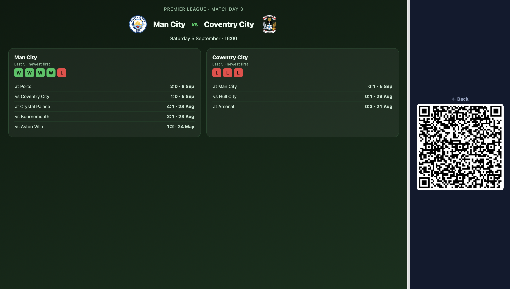
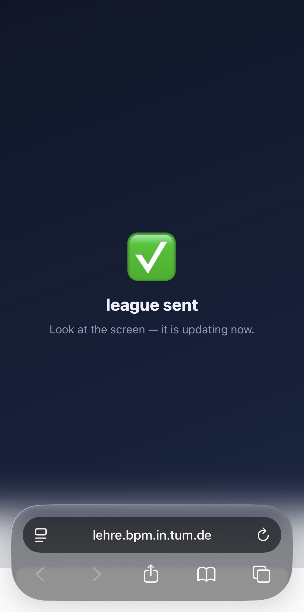
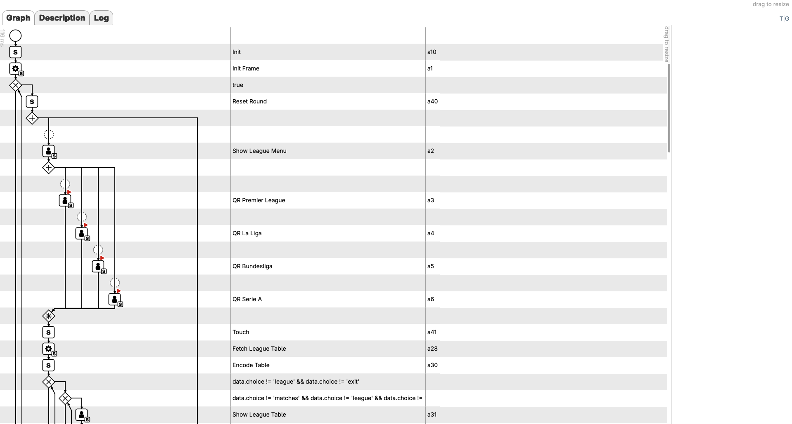
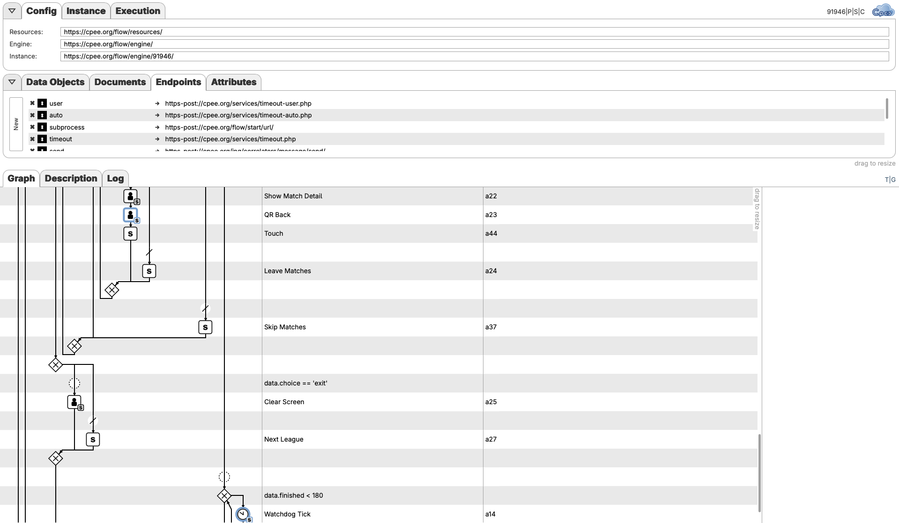
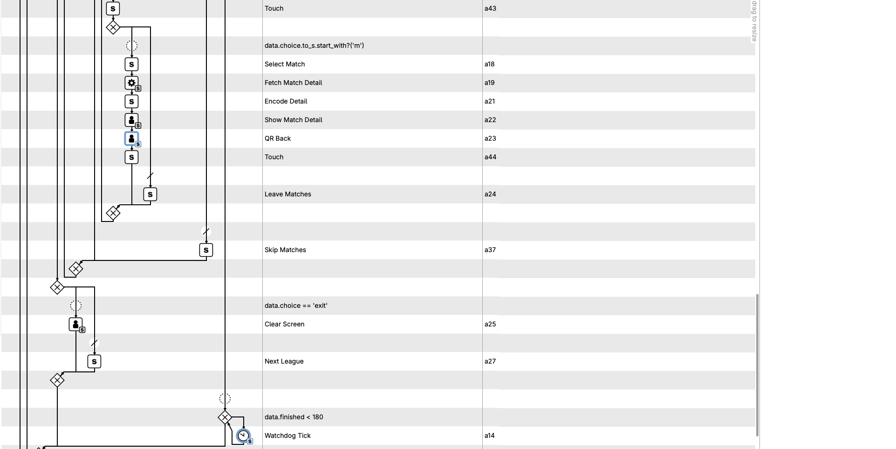
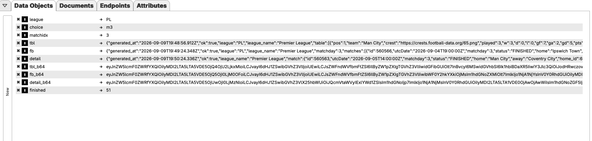
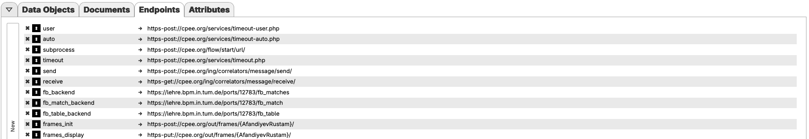

# Football Board

Practical course SS 2026, TUM (supervisor: J. Mangler).

A touch-free football kiosk. On the left, the visitor picks one of four
leagues by scanning a QR code; on the right sit the navigation QR codes.
For the chosen league the board shows the standings, the current
matchday with results and kickoff times, and for every match the recent
form of both teams.

## Features

- 4 leagues (Premier League, La Liga, Bundesliga, Serie A), selected by
  scanning a QR code with a phone
- Standings: position, played, W/D/L, goals, difference, points
- Matchday: the complete current matchday, finished games with the
  score, remaining games with kickoff time
- Match detail: form of both teams (W/D/L chips, opponent, result)
- Navigation only via QR: Matchday, Table, Change league, Back, Exit
- Watchdog: after 180 s without a scan the kiosk returns to the league
  menu by itself and keeps running

## Screenshots

| League menu | Standings | Matchday |
|---|---|---|
|  |  |  |

| Match detail | Phone |
|---|---|
|  |  |

## Architecture

Core rule: the CPEE process never calls an external API. Everything
external is done by the own server; the process only tells it "get
league X" and receives the prepared data back.

```
                 +-----------------------+
football-data.org|  football_backend.js  |
   <------------ |  (Node, port 12783)   |
                 +-----------+-----------+
                             | answers with JSON,
                             | also writes files
                             v
        football.json   match.json   table.json     (public_html)
                             |
                     CPEE process
                  (Base64 in the page URL)
                             |
                             v
         https://cpee.org/out/frames/AfandiyevRustam
                             ^
                             | scan -> fb_send.html -> cpee_callback
                          phone
```

- The server answers the process directly with the result. The JSON
  files are written in addition: for inspection while debugging, and
  because `/fb_match` looks up the selected match in `football.json`.
- Per league, football-data.org is queried at most every 5 minutes
  (free tier: 10 requests per minute).
- Data travels to the frame as Base64 in the page URL. Back to the
  process travel only codes and indexes (`BL1`, `m3`, `table`), never
  names: non-ASCII characters do not survive the callback path.

## The CPEE process

  

Data elements and endpoints of the model:

| Data elements | Endpoints |
|---|---|
|  |  |

One round:

1. Init Frame creates the 10x8 grid (once)
2. Reset Round clears `finished`, `choice` and `league`
3. Show League Menu displays the menu; four QR frames race each other
   as `parallel wait="1" cancel="last"` - the first scan wins, the
   other three are cancelled
4. Fetch League Table has the server fetch the standings and stores
   the answer directly in `data.tbl`; Show League Table displays it
5. Scan "Matchday": Fetch League Matches, then the Matchday Board
   shows the matchday; the board itself is a waiting frame and races
   the three navigation QR codes
6. Scan a match (`m3`): Select Match, Fetch Match Detail, Show Match
   Detail, QR Back
7. Scan "Table" returns to the standings, "Change league" to the
   league menu, "Exit" clears the screen - in every case the next
   round starts

Four nested loops carry the flow: kiosk (endless), league (until
Change league or Exit), standings screen, and matchday. Each loop
condition names exactly the words that leave it.

Watchdog: `finished` is set to 0 at the start of a round and after
every interaction; a parallel branch counts up in 3-second steps.
When it reaches 180, the waiting frame is cancelled and the round
starts over. The process runs forever; there is no `<stop>`.

Board: the process can be started as a subprocess - it lives in the
hub, needs no input, and addresses the display only through the
endpoints `frames_init` and `frames_display`. URL:
<https://cpee.org/hub/server/Teaching.dir/Prak.dir/TUM-Prak-26-SS.dir/AfandiyevRustam.dir/football.xml/>

## Files and data flow

| File | written by | read by | cadence |
|---|---|---|---|
| table.json | server (`/fb_table`) | - (process receives the answer directly) | per league choice, cache 5 min |
| football.json | server (`/fb_matches`) | server (`/fb_match` looks up `matches[idx]`) | per matchday request, cache 5 min |
| match.json | server (`/fb_match`) | - | per match choice |

## Backend (football_backend.js)

| Route | Task |
|---|---|
| /fb_table?league=BL1 | fetch standings, write `table.json`, return standings |
| /fb_matches?league=BL1 | fetch current matchday, write `football.json`, return it |
| /fb_match?league=BL1&idx=3 | match `idx` from `football.json`, form of both teams (last 5), write `match.json`, return it |
| / | health check, list of leagues |

League codes: `PL`, `PD`, `BL1`, `SA`. The football-data.org API key is
read from the environment variable `FB_KEY` and is not in the code.
Non-ASCII characters are written as `\uXXXX`, so club names cannot be
garbled on any path.

## Pages

- fb_menu.html - start page with instructions, left column; the four
  league QR codes next to it are separate fb_qr frames
- fb_qr.html - generic QR frame: renders the callback of the waiting
  task as a QR code, parameters `value` and `labelb`
- fb_send.html - opened on the phone, sends `value` as a PUT to the
  callback
- fb_table.html - standings
- fb_matches.html - matchday, every match with its own QR code (`m0`,
  `m1`, ...)
- fb_match.html - match detail with form

All pages read their data from the `data` parameter of the URL (Base64).

## Running it

1. Server on lehre:
   `export FB_KEY=...` then
   `nohup node football_backend.js > football_backend.log 2>&1 &`
2. HTML pages into `~/public_html`
3. Load football.xml in CPEE as a new instance and start it
4. Display: <https://cpee.org/out/frames/AfandiyevRustam>
